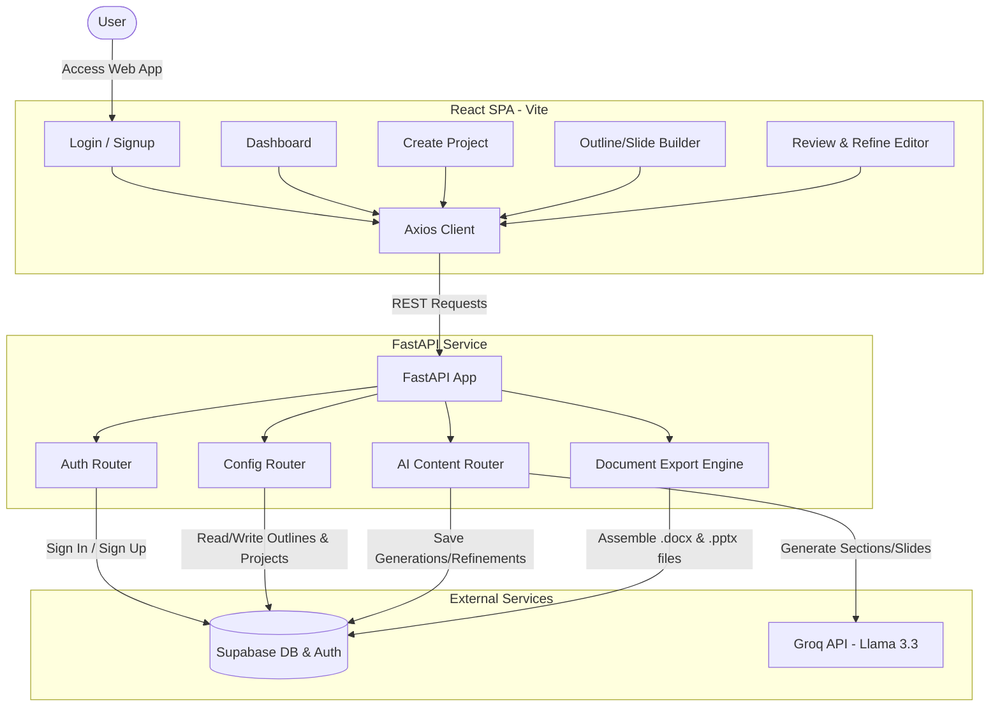
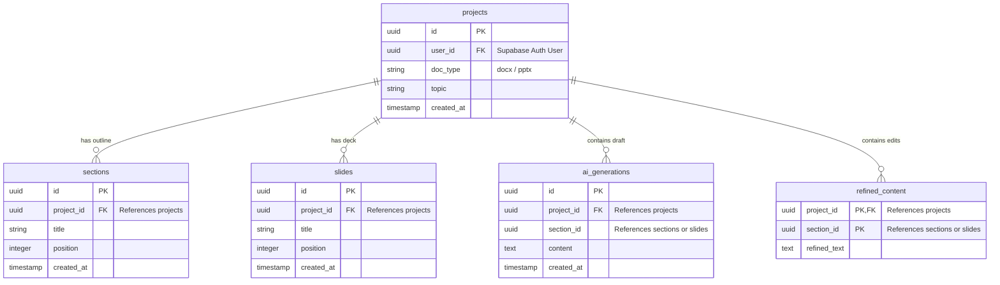

## AI Document & Presentation Generator

AI Document & Presentation Generator is a modern full-stack web application designed to automatically generate professional Word documents (`.docx`) and PowerPoint presentations (`.pptx`) using AI. 

Users can log in, input a topic, define a custom document outline or slide deck structure, generate high-quality content via Groq LLMs (Llama-3.3-70b), refine the text in an interactive editor, and download ready-to-use Office documents.

---

## 🏗️ System Architecture

The application is built using a decoupled architecture, with a **React SPA** frontend and a **FastAPI** backend. It uses **Supabase** for database storage and user authentication, and **Groq** for high-speed AI content generation.



---

## 🌟 Key Features

1. **Secure Authentication**:
   - Integrates directly with **Supabase Authentication** for signup and login.
   - Restricts document creation and configuration endpoints to authenticated users using JWT verification.
2. **Flexible Document Configuration**:
   - Create projects with custom topics and choose the desired output type (Word `.docx` or PowerPoint `.pptx`).
   - Interactively build outlines (sections for Word documents, slide titles for PowerPoint decks) before generation.
3. **AI-Powered Draft Generation**:
   - Uses Groq's high-speed **Llama-3.3-70b-versatile** model to draft contextual content.
   - Word Documents: Generates detailed, professional paragraphs (150–250 words) per section.
   - PowerPoint Presentation: Generates 4–6 concise, presentation-ready bullet points (10–25 words each) per slide.
4. **Interactive Review & Editor**:
   - Edit generated sections and slide bullets directly in the browser.
   - Refinements are automatically saved back to the database.
   - Offers quick-action modifiers (e.g. *Shorten*, *More Formal*, *Convert to Bullets*).
5. **Native File Generation**:
   - Assembles and compiles documents on the backend using `python-docx` and `python-pptx` to generate standard Microsoft Office files matching your outline and content.

---

## 💻 Tech Stack

### Backend
- **Framework**: FastAPI (Python 3.11+)
- **Database & Auth Client**: Supabase Python SDK
- **AI/LLM API**: Groq Python SDK (Llama 3.3 model)
- **Document Creation Libraries**:
  - `python-docx` for creating Microsoft Word files.
  - `python-pptx` for creating Microsoft PowerPoint files.
- **Server Environment**: Uvicorn / Starlette CORS Middleware

### Frontend
- **Framework**: React 19 (Vite)
- **Routing**: React Router DOM v7
- **HTTP Client**: Axios (configured to query the Render-hosted backend)
- **Design System**: Vanilla CSS with custom glassmorphism and modern gradient panels

---

## 💾 Database Schema

The application stores metadata and configurations in **Supabase PostgreSQL**. The tables and columns are structured as follows:



---

## 🚀 Setup & Installation

### Prerequisites
- Python 3.11+
- Node.js 18+
- Supabase Project (with tables matching the schema)
- Groq API Key

### 1. Configuration & Env Variables
Create a `.env` file in the root directory:
```env
SUPABASE_URL=your_supabase_project_url
SUPABASE_KEY=your_supabase_anon_key
GROQ_API_KEY=your_groq_api_key
```

### 2. Backend Setup
1. Navigate to the backend directory:
   ```bash
   cd backendai
   ```
2. Set up a virtual environment (recommended):
   ```bash
   python -m venv venv
   .\venv\Scripts\activate
   ```
3. Install dependencies:
   ```bash
   pip install -r r.txt
   ```
4. Run the development server:
   ```bash
   uvicorn main:app --reload --port 8000
   ```
The backend API is now running locally at `http://localhost:8000`.

### 3. Frontend Setup
1. Navigate to the frontend directory:
   ```bash
   cd frontendai
   ```
2. Install the frontend dependencies:
   ```bash
   npm install
   ```
3. Run the development server:
   ```bash
   npm run dev
   ```
The web application is now running locally at `http://localhost:5173`.

> 💡 **Note on API Configuration**: The frontend sends requests to a live deployment hosted on Render by default. To point it to your local backend, update the base URLs in the frontend files (e.g. `login.jsx`, `signup.jsx`, `CreateProject.jsx`, `configure.jsx`, `refine.jsx`) from `https://ai-doc-generator-backendd.onrender.com` to `http://localhost:8000`.

---

## 📁 Project Structure

```text
├── backendai/
│   ├── main.py            # Application entry point & CORS configuration
│   ├── auth.py            # Supabase auth handlers (signup / login)
│   ├── config.py          # Project outlines, sections, and slide configuration APIs
│   ├── ai.py              # LLM prompt triggers & draft builders
│   ├── export.py          # .docx and .pptx document compilation engine
│   ├── database.py        # Supabase client instantiation
│   ├── llm.py             # Groq SDK configuration & completion handler
│   ├── models.py          # SQLAlchemy declarations (alternative reference)
│   ├── schemas.py         # Pydantic request & response validators
│   ├── r.txt              # Backend python package requirements
│   └── render.yaml        # Render cloud deployment blueprint
│
├── frontendai/
│   ├── package.json       # React dependencies and scripts
│   ├── index.html         # Application viewport index
│   ├── src/
│   │   ├── main.jsx       # React application mounting
│   │   ├── app.jsx        # Routing configuration and router definition
│   │   ├── index.css      # Core styles & styling tokens
│   │   ├── App.css        # Layout specific style definitions
│   │   ├── components/
│   │   │   └── protectedroute.jsx  # Client-side router auth guard
│   │   └── pages/
│   │       ├── signup.jsx          # Register user layout and client calls
│   │       ├── login.jsx           # Sign in view and JWT generation
│   │       ├── dashboard.jsx       # Logged-in page to start workflows
│   │       ├── CreateProject.jsx   # Select doc type and prompt topic
│   │       ├── configure.jsx       # Outline config (add sections / slides)
│   │       └── refine.jsx          # AI editor, adjustments, and downloads
│   └── vercel.json        # Frontend hosting config file
```
